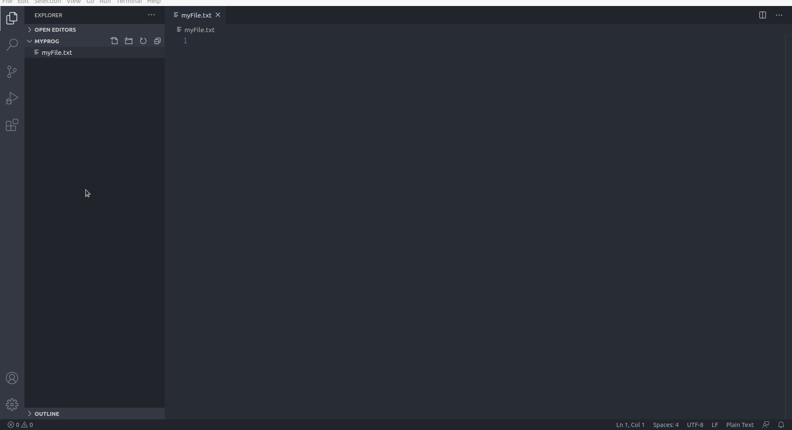

## Cenni storici
Originariamente sviluppato da Brendan Eich della Netscape Communications con il nome di Mochan e successivamente di LiveScript, in seguito è stato rinominato "JavaScript" ed è stato formalizzato con una sintassi più vicina a quella del linguaggio Java di Sun Microsystems (che nel 2010 è stata acquistata da Oracle). Standardizzato per la prima volta il 1997 dalla ECMA con il nome ECMAScript, l'ultimo standard, di giugno 2017, è ECMA-262 Edition 8 ed è anche uno standard ISO (ISO/IEC 16262).

[Wikipedia - JavaScript](https://it.wikipedia.org/wiki/JavaScript)

## Aspetti strutturali

Le caratteristiche principali di JavaScript sono:

- essere un linguaggio interpretato: il codice non viene compilato, ma eseguito direttamente; in JavaScript lato client, il codice viene eseguito dall'interprete contenuto nel browser dell'utente.
- la sintassi è relativamente simile a quella dei linguaggi C, C++ e Java.
- definisce le funzionalità tipiche dei linguaggi di programmazione ad alto livello (strutture di controllo, cicli, ecc.) e consente l'utilizzo del paradigma object oriented.
- è un linguaggio debolmente tipizzato.
- è un linguaggio debolmente orientato agli oggetti. Ad esempio, il meccanismo dell'ereditarietà è più simile a quello del Self e del NewtonScript che a quello del linguaggio Java, fortemente orientato agli oggetti. Gli oggetti stessi ricordano più gli array associativi del linguaggio Perl che gli oggetti di Java o C++.

Altri aspetti di interesse: in JavaScript lato client, il codice viene eseguito direttamente sul client e non sul server. Il vantaggio di questo approccio è che, anche con la presenza di script particolarmente complessi, il web server non rischia sovraccarichi dato che il lavoro viene svolto dal client. Un rovescio della medaglia è che, nel caso di script particolarmente grandi, il tempo per il trasferimento dalla rete può diventare eccessivamente lungo. Inoltre ogni informazione che presuppone un accesso a dati memorizzati in una base di dati remota deve essere rimandata a un linguaggio che effettui materialmente la transazione, per poi restituire i risultati ad una o più variabili JavaScript; operazioni del genere richiedono un nuovo caricamento della pagina stessa. Questi limiti sono però stati superati in buona parte con la nascita di AJAX.

Alcune altre caratteristiche di JavaScript degne di nota:

- Può usare caratteri Unicode
- Può valutare le espressioni regolari (introdotte nella versione 1.2; supporto da parte dei browser: a partire da Netscape Navigator 4 e Internet Explorer 4)
- Le espressioni JavaScript contenute in una stringa possono essere valutate usando la funzione eval.

[Wikipedia - JavaScript](https://it.wikipedia.org/wiki/JavaScript)

## Versioni di Javascript

Un linguaggio di programmazione per essere definito uno standard ha bisogno di essere revisionato da un organo dedicato che prende il nome di ECMA International. Da questo lavoro è nato un nuovo standard che prende il nome di ECMAScript, anche se per tutti noi il termine JavaScript è rimasto sufficiente per definirlo.

Nel corso degli anni lo standard ha definito nuove versioni e aggiornamenti del linguaggio e delle funzionalità. Nel contempo i browser si sono adattati alle modifiche introdotte per supportare il nuovo standard. Per orientarsi al supporto allo stato attuale da parte dei browser dei nuovi standard Javascript è possibile visionare la seguente tabella:

[github - es6 table](https://kangax.github.io/compat-table/es6/)

Possiamo affermare che la versione più utilizzata ad oggi è ES6, la ES5 è obsoleta ma di fatto ormai anche la ES2016+ è supportata da tutti i browser.

**Indice riassuntivo:**

- **ECMAScript** – un linguaggio standardizzato dal ECMA Internetional e supervisionato dal comitato T39;
- **JavaScript** – il nome comune utilizzato per identificare lo standard ECMAScript. Con questo termine non ci rivolgiamo a una specifica versione dello standard, ma piuttosto al suo utilizzo a livello globale o parziale.
- **ECMAScript 5 (ES5)** – questa rappresenta la quinta versione dello standard ECMAScript rilasciata nel 2009. Dato che a oggi i maggiori browser supportano questa versione è probabile che sarà la più comune da incontrare.
- **ECMAScript 6 (ES6)/ECMAScript 2015 (ES2015)** – questa rappresenta la sesta versione dello standard ECMAScript rilasciata nel 2015. Al momento non è ancora supportata completamente dai nuovi browser e dato che presenta un gran numero di moduli ti consiglio di consultare questa tabella aggiornata.
- **ECMAScript 2016** – rilasciata a inizio 2016 presenta un esiguo numero di funzionalità implementate e non dovrebbe comportare grossi problemi di compatibilità nei browser in grado di supportare la versione ES2015.

[skillsandmore - Conosci tutte le versioni di Javascript?](https://skillsandmore.org/javascript-nomi-versione/)

## Configurazione di un IDE

Un ambiente di sviluppo integrato (in lingua inglese integrated development environment ovvero IDE, anche integrated design environment o integrated debugging environment, rispettivamente ambiente integrato di progettazione e ambiente integrato di debugging), in informatica, è un ambiente di sviluppo ovvero un software che, in fase di programmazione, supporta i programmatori nello sviluppo e debugging del codice sorgente di un programma: spesso l'IDE aiuta lo sviluppatore segnalando errori di sintassi del codice direttamente in fase di scrittura, oltre a tutta una serie di strumenti e funzionalità di supporto alla fase stessa di sviluppo e debugging.

[Wikipedia - Integrated development environment](https://it.wikipedia.org/wiki/Integrated_development_environment)

### Visual Studio Code - VS code

Visual Studio Code è un editor di codice sorgente sviluppato da Microsoft per Windows, Linux e macOS. Include il supporto per debugging, un controllo per Git integrato, Syntax highlighting, IntelliSense, Snippet e refactoring del codice. Sono personalizzabili il tema dell'editor, le scorciatoie da tastiera e le preferenze. È un software libero e gratuito, anche se la versione ufficiale è sotto una licenza proprietaria.

Visual Studio Code è basato su Electron, un framework con cui è possibile sviluppare applicazioni Node.js.

[Wikipedia - Visual Studio Code](https://it.wikipedia.org/wiki/Visual_Studio_Code)

In questo corso useremo [Visual Studio Code](https://code.visualstudio.com/download) come IDE con le seguenti **Estensioni:**

- **HTML snippets**
- **javascript es6 code snippets**
- **live server**

Per installare un'estensione con VS code vi rimando alla seguente immagine animata:

 

 