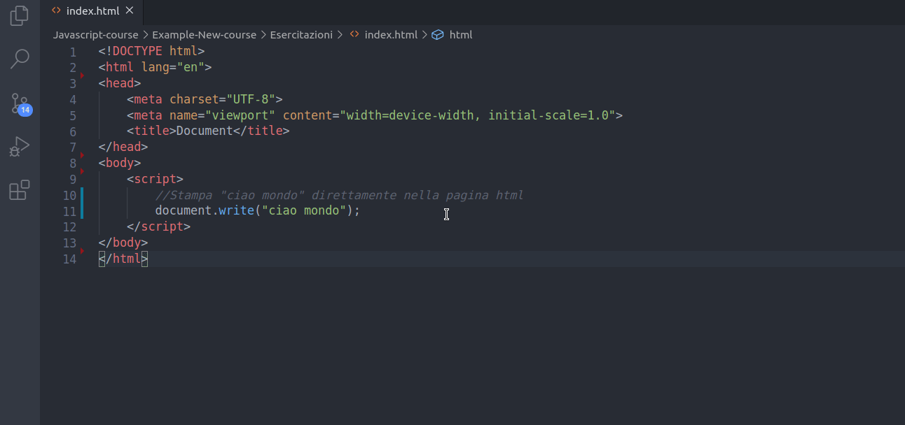

## Primo script

Come integro codice javascript all'interno di una pagina html?
- Modo 1: E' possibile inserire codice Javascript direttamente all'interno della pagina html tramite il tag `<script></script>`.
- Modo 2: E' possibile creare un collegamento con un file esterno con estensione `.js` che rappresenterà il file contente codice Javascript. Per creare tale collegamento è necessario inserire prima della chiusura del `body` il seguente link-tag
```html
<script src="main.js"></script>
```

**Modo 1: Codice Javascript interno alla pagina html**<br>

`File html`
```HTML
<!DOCTYPE html>
<html lang="en">
<head>
    <meta charset="UTF-8">
    <meta name="viewport" content="width=device-width, initial-scale=1.0">
    <title>Document</title>
</head>
<body>
    <script>
        //Stampa "ciao mondo" direttamente nella pagina html
        document.write("ciao mondo");
    </script>
</body>
</html>
```

Una volta creato il file è possibile aprirlo direttamente con un web browser o tramite l'estensione di VS code *live server* che permette di lanciare l'aggiornamento della pagina in automatico quando si salva il file




**Modo 2: Collegamento al file javascript main.js** <br>

`File html`
```html
<!DOCTYPE html>
<html lang="en">
<head>
    <meta charset="UTF-8">
    <meta name="viewport" content="width=device-width, initial-scale=1.0">
    <title>Document</title>
</head>
<body>
    <script src="main.js"></script>
</body>
</html>
```

`File JS`
```js
//Stampa "ciao mondo" direttamente nella pagina html
document.write("ciao mondo");
```

Il modo migliore è sempre quello di creare file separati per dividere il contesto tra html / css / Javascript soprattutto per progetti grandi e strutturati. In questo corso per motivi di praticità invece utilizzeremo spesso codice Javascript all'interno della pagina html 


 

 