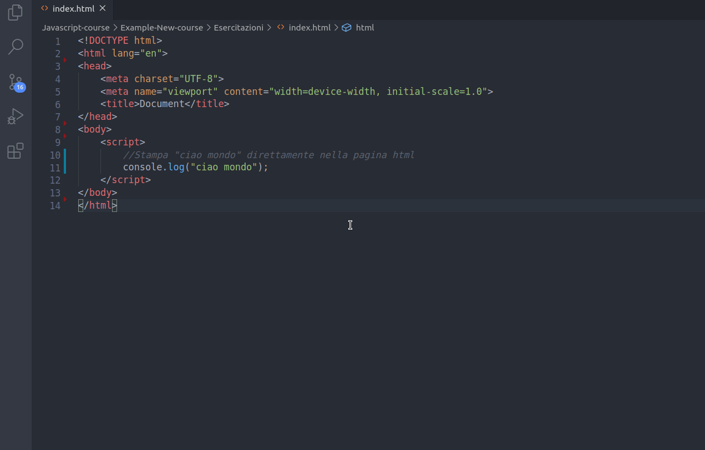

## Console - Browser Web

La console è uno strumento molto utile in fase di sviluppo software all'interno del browser web. Segnala errori e warning sintattici dell'interprete javascript ed è molto utilizzata in fase di debug. E' uno strumento interattivo, permette quindi la generazione di script Javascript in real-time e di stampare il valore di alcune variabili o strutture dati per monitorare il corretto funzionamento dello script.

Il comando `console.log()` (o per meglio dire il metodo `log()` dell'oggetto `Console`, parleremo più avanti di metodi e oggetti..) stampa un messaggio sulla web console del browser. Il messaggio può essere una semplice stringa (opzionalmente, anche con valori sostituibili), o può essere uno qualsiasi o più oggetti JavaScript.

`File html`
```html
<!DOCTYPE html>
<html lang="en">
<head>
    <meta charset="UTF-8">
    <meta name="viewport" content="width=device-width, initial-scale=1.0">
    <title>Document</title>
</head>
<body>
    <script>
        //Stampa "ciao mondo" direttamente nella pagina html
        console.log("ciao mondo");
    </script>
</body>
</html>
```



Riporto qualche comando (metodo) aggiuntivo della console:

```js
console.log('Ciao a tutti');         //stampa sulla console
console.warn('Avvertimento');        //Genera un warning
console.error('questo è un errore'); //Genera un errore
console.table({name: 'simone'});     //Stampa in formato tabella
console.clear();                     //Pulisce la console
```
E' bene comuqnue precisare che qualsiasi cosa venga stampata sulla console come log, errori o warning non saranno visibili all'utente ma solo in modalità sviluppatore.

Una lista di tutti i metodi applicabili all'oggetto si trova alla pagina [MDN - Console](https://developer.mozilla.org/it/docs/Web/API/Console)

## Alert & prompt

`alert()` mostra una finestra di avviso contenente il testo specificato mentre `prompt()` mostra una finestra di dialogo che chiede all'utente di inserire del testo.

```html
<!DOCTYPE html>
<html lang="en">
<head>
    <meta charset="UTF-8">
    <meta name="viewport" content="width=device-width, initial-scale=1.0">
    <title>Document</title>
</head>
<body>
    <script>
        //Salva l'input ricevuto in una variabile cioè un contenitore testuale 
        myName = prompt('Come ti chiami?');
        alert("Il tuo nome è ..");
        //Stampa il valore testuale contenuto nella variabile
        alert(myName);
    </script>
</body>
</html>
```


Approfondimenti sul metodo `alert()` dell'oggetto `Window` li trovate su [MDN - Window.alert()](https://developer.mozilla.org/it/docs/Web/API/Window/alert) mentre approfondimenti sul metodo `prompt()` dell'oggetto `Window` li trovate su [MDN - Window.prompt()](https://developer.mozilla.org/it/docs/Web/API/Window/prompt)

## Commenti

I commenti sono linee testuali non processate dall'interprete utili per la documentazione del codice. In javascritp ci sono due tipi di sintassi permesse per l'inserimento dei commenti.
- `// comment`: per commenti inline
- `/* comment */`: per commenti su linee multiple

```js
//inline comment

/*
multi line comment
console.log('ciao a tutti');
*/
```


