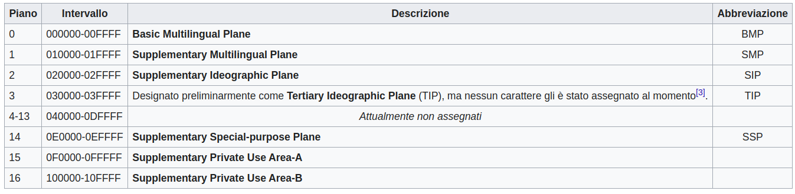

## Approfondimento - Codifica caratteri Javascript

Questa parte per adesso potrebbe essere troppo approfondita, è possibile saltarla senza pregiudicare il corso

## ASCII

ASCII (acronimo di American Standard Code for Information Interchange, Codice Standard Americano per lo Scambio di Informazioni) è un codice per la codifica di caratteri. Lo standard ASCII è stato pubblicato dall'American National Standards Institute (ANSI) nel 1968

Con US-ASCII si intende un sistema di codifica dei caratteri a 7 bit, comunemente utilizzato nei calcolatori, proposto dall'ingegnere dell'IBM Bob Bemer nel 1961, e successivamente accettato come standard dall'ISO, con il nome di ISO/IEC 646.

Alla specifica iniziale basata su codici di 7 bit fecero seguito negli anni molte proposte di estensione ad 8 bit e quindi 256 caratteri, con lo scopo di raddoppiare il numero di caratteri rappresentabili. Nei PC IBM si fa per l'appunto uso di una di queste estensioni, ormai standard de facto, chiamata extended ASCII o high ASCII. In questo ASCII esteso, i caratteri aggiunti sono vocali accentate, simboli semigrafici e altri simboli di uso meno comune. I caratteri di ASCII esteso sono codificati nei cosiddetti codepage. Ogni paese presentò la sua proposta di ASCII esteso per rappresentare e codificare tutti i caratteri aggiuntivi relativi alla lingua creando non pochi problemi di comunicazione tra continenti. C'era quindi bisogno di uno standard nuovo e unico per tutto il mondo. Nasce quindi l'UNICODE.

[Wikipedia - ASCII](https://it.wikipedia.org/wiki/ASCII)

## Unicode

Unicode è stato creato per risolvere i limiti dei tradizionali schemi di codifica dei caratteri Ad esempio , sebbene i caratteri definiti nella ISO 8859-1 siano ampiamente utilizzati in paesi diversi, spesso si verifica incompatibilità tra paesi diversi. Molti metodi di codifica tradizionali hanno un problema comune, ovvero consentono ai computer di gestire un ambiente bilingue (di solito utilizzando lettere latine e le loro lingue native), ma non possono supportare un ambiente multilingue allo stesso tempo (riferendosi a una situazione in cui più lingue possono essere mescolate contemporaneamente).

Unicode era stato originariamente pensato come una codifica a 16 bit (quattro cifre esadecimali) che dava la possibilità di codificare 65.535 (2^16 -1) caratteri. Tanto si riteneva essere sufficiente per rappresentare i caratteri impiegati in tutte le lingue scritte del mondo. Ora invece lo standard Unicode, che tendenzialmente è perfettamente allineato con la norma ISO/IEC 10646, prevede una codifica fino a 21 bit e supporta un repertorio di codici numerici che possono rappresentare circa un milione di caratteri. Ciò appare sufficiente a coprire anche i fabbisogni di codifica di scritti del patrimonio storico dell'umanità, nelle diverse lingue e negli svariati sistemi di segni utilizzati.

Al 2009, solo una piccolissima parte di questa disponibilità di codici è assegnata. Per lo sviluppo dei codici sono infatti previsti 17 "piani" ("planes", in inglese), da 00 a 10hex, ciascuno con 65.536 posizioni (quattro cifre esadecimali), ma solo i primi tre e gli ultimi tre piani sono ad oggi assegnati[2], e di questi il primo, detto anche BMP, è praticamente sufficiente a coprire tutte le lingue più usate.



Concretamente, questo repertorio di codici numerici è serializzato mediante diversi schemi di ricodifica, che consentono l'uso di codici più compatti per i caratteri usati più di frequente. È previsto l'uso di codifiche con unità da 8 bit (byte), 16 bit (word) e 32 bit (double word), descritte rispettivamente come UTF-8, UTF-16 e UTF-32. UTF-8 è di fatto lo standard successore di ASCII, perfettamente compatibile mentre javascript utilizza l'UTF-16 consentendo di rappresentare un numero elevato di caratteri, 655536. Ciò non significa che per le codifiche UTF-8 e UTF-16 non sia possibile rappresentare tutti i caratteri unicode ma a causa della codifica potrebbe non essere conveniente in certe situazioni utilizzare UTF-8 anzichè UTF-16. In certe situazioni infatti UTF-8 potrebbe aver bisogno di 3 byte per rappresentare un certo carattere mentre UTF-16 soltanto 2. Dipende dalla frequenza e natura dei caratteri. 

Si rirprenda il template html:
```html
<!DOCTYPE html>
<html lang="en">
<head>
    <meta charset="UTF-8">
    <meta name="viewport" content="width=device-width, initial-scale=1.0">
    <title>Document</title>
</head>
<body>
    
</body>
</html>
```

Alla riga

```html
<meta charset="UTF-8">
```
E' indicata la codifica necessaria per la trasmissione e visualizzazione corretta dei caratteri.


[Wikipedia - Unicode](https://en.wikipedia.org/wiki/Plane_(Unicode)) <br>
[Wikibooks - Unicode/Character reference/0000-0FFF](https://en.wikibooks.org/wiki/Unicode/Character_reference/0000-0FFF)<br>


## Caratteri di Escape

Il backslash `\` indica la presenza di un carattere escape che non sarebbe possibile inserire direttamente con un editor di testo poichè verrebbe interpretato come un comando.

Vediamo qualche carattere di escape:

- `\n`: a capo
- `\t`: tab
- `\b`: Backspace
- `\r`: Carriage return
- `\\`: Backslash
- `\'`: Single quote
- `\"`: Double quote


Introdotti gli escape è possibile vedere come inserire un carattere UNICODE tramite il suo codice identificatico: `\u{codice_unicode}`

```js 
let str = "\u{1234}"; // ሴ === 1234 codice unicode, 1 carattere
console.log (str);
console.log (str, str.lenght); //ሴ, 1

//Attenzione!! la codifica UTF-16 non raggiunge direttamnte il carattere stampato qui di seguito
//Utilizza quindi 2 caratteri Javascript
let str = "\u{1F600}"; // 😀 === 1F600 codice unicode, 2 caratteri
console.log (str, str.lenght); //😀, 2
```

Posso risalire al codice unicode tramite il metodo `charCodeAt(index)` che restituisce il codice unicode del carattere specificato da `index`. 

```js

let str = "\u{1F600}"; // 😀 === 1F600 codice unicode 2 caratteri
console.log (str); //😀
console.log(str.charCodeAt(0), strCharCodeAt(1)); //55357 56832
```

C'è anche il metodo che più completo `charCodePointAt(index)` che restituisce il codice unicode che *inizia* da `index`. Questo è necessario per quei caratteri che non possono essere rappresentati da UTF-16 e che quindi sono necessari "due caratteri" Javascript 

```js
let str = "\u{1F600}"; // 😀 === 1F600 codice unicode 2 caratteri
console.log (str); //😀
console.log(str.codePointAt(0)); // 128512 === 1F600 
```

Posso usare l'unicode anche per il nome di variabili! Da evitare.

```js
var \u{1f68} = 2017; // Ὠ
```


 

  