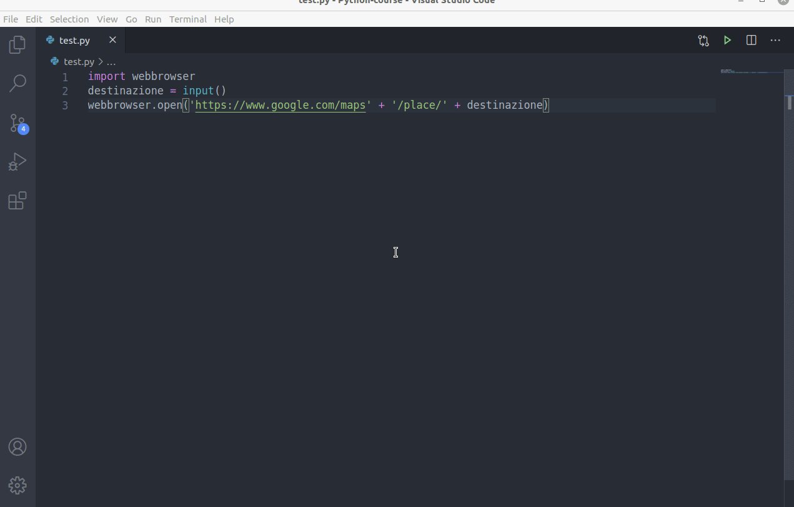
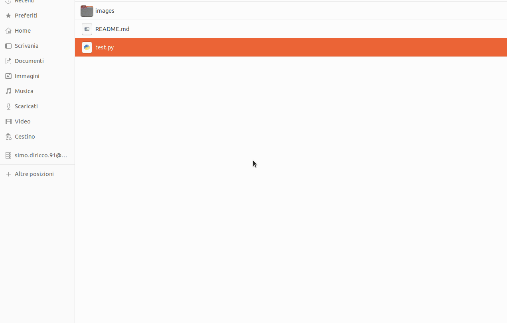

## Primo script

Ogni file python ha un'estensione `.py`.

Per l'esecuzione di uno script python è possibile lanciare il file creato con l'estensione `.py` (esempio `test.py`) direttamente dal terminale digitando il comando per l'invocazione dell'interprete python `python3` ad esempio `python3 test.py` all'interno della cartella contenente il file `test.py` oppure attraverso l'estensione appena installata per VS code `Run/Start Debugging`

Ecco l'esecuzione del primo script python
```py
print('ciao mondo')
```


## Aggiunta di moduli

Per l'aggiunta di un modulo che rientra nella libreria standard python basta semplicemente digitare:

```py
import <nomeModulo>
```
A volte tuttavia potremmo aver bisogno di un modulo non standard disponibile sul web. Per installarlo possiamo far ricorso al pacchetto `pip` che permette la gestione e l'installazione dei moduli aggiuntivi python.

Supponiamo di voler scaricare il modulo `PyPDF2` per la gestione dei PDF. Digitare da terminale
```bash
pip install PyPDF2
```

Qualora si avessero dubbi sul nome del modulo o sul comando esatto, niente paura, il browser ci è di supporto


## Introduzione a webbrowser

Il seguente script aprirà una località su google.maps digitata come input dall'utente.

Utilizzeremo il comando `input()` che permette l'acquisizione dati da tastiera e la funzione `open` del modulo python `webbrowser`. <br>
La funzione `open` permette di aprire un certo `url` specificato come parametro tra gli apici. Il parametro è quindi passato come una stringa e come tale valgono tutte le operazioni e i metodi applicabili su stringa tra cui l'operatore `+` utilizzato per concatenare due o più stringhe .

- `input()`: consente l'acquisizione dati da tastiera dell'utente.
- `webbrowser.open(myUrl)`: Apre l'indirizzo web specificato dal parametro *myUrl*. Il parametro specificato viene passato come stringa
- `+`: Operatore di concatenazione stringhe

Ecco lo script completo:

```py
import webbrowser
destinazione = input()
webbrowser.open('https://www.google.com/maps' + '/place/' + destinazione)
```



E' possibile ridurre ancora il codice

```py
import webbrowser
webbrowser.open('https://www.google.com/maps' + '/place/' + input())
```

## Come rendo eseguibile un file python?

## Linux

Aggiungere la seguente linea di codice in testa allo script:

```py
#!/usr/bin/env python3
```

Ad esempio:

```py
#!/usr/bin/env python3
import webbrowser
webbrowser.open('https://www.google.com/maps' + '/place/' + input())
```

E' sufficiente rendere il file *eseguibile* (all'interno delle proprietà del file sezione "permessi") e lanciarlo da terminale.



## Commenti 

```py
# questo è un commento e verrà ignorato dall'interprete
print('ciao')
```
