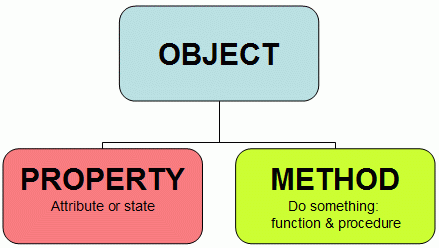

## OOP Object Oriented Programming

Si ricordi la frase di apertura di questo corso:  
*In informatica JavaScript è un linguaggio di programmazione orientato agli oggetti e agli eventi...*  

Ma che cos'è un linguaggio di programmazione orientato agli oggetti?

In informatica, la programmazione orientata agli oggetti (in inglese object-oriented programming, in acronimo OOP) è un paradigma di programmazione che permette di definire oggetti software in grado di interagire gli uni con gli altri attraverso lo scambio di messaggi. Particolarmente adatta nei contesti in cui si possono definire delle relazioni di interdipendenza tra i concetti da modellare (contenimento, uso, specializzazione), un ambito che più di altri riesce a sfruttare i vantaggi della programmazione ad oggetti è quello delle interfacce grafiche.

Tra gli altri vantaggi della programmazione orientata agli oggetti:

- essa fornisce un supporto naturale alla modellazione software degli oggetti del mondo reale o del modello astratto da riprodurre;
- permette una più facile gestione e manutenzione di progetti di grandi dimensioni;
l'organizzazione del codice sotto forma di classi favorisce la modularità e il riuso di codice.

*Fonte: https://it.wikipedia.org/wiki/Programmazione_orientata_agli_oggetti*

Ma non esiste solo il paradigma di programmazione orientato agli oggetti. Altri due paradigmi di programmazione sono il paradigma di *programmazione procedurale* e il paradigma di *programmazione imperativa*

**Programmazione Procedurale**

In informatica la programmazione procedurale è un paradigma di programmazione che consiste nel creare dei blocchi di codice sorgente, identificati da un nome e racchiusi da dei delimitatori, che variano a seconda del linguaggio di programmazione; questi sono detti anche sottoprogrammi (in inglese subroutine), procedure o funzioni, a seconda del linguaggio e dei loro ruoli all'interno del linguaggio stesso. Il nome deriva dal linguaggio COBOL, che è stato il primo ad utilizzare questo concetto.

Questi blocchi possono essere dotati di parametri, cioè variabili locali i cui valori vengono forniti o passati dall'esterno del blocco di codice ed eventualmente esportati; esistono due tipi di parametri: quelli di tipo valore e quelli di tipo variabile; nei primi viene passato un valore che, se modificato, non viene comunque salvato al termine del sottoprogramma; nel tipo variabile invece, viene comunicato l'indirizzo della cella di memoria (ad es.tramite un puntatore) al quale troviamo l'informazione, che può quindi essere modificata effettivamente e permanentemente. All'interno di un sottoprogramma possono essere generalmente definite o dichiarate delle variabili locali, che vengono deallocate al termine del sottoprogramma stesso; il loro contenuto viene quindi perso se non salvato o trasmesso altrimenti.

In Linguaggio C esiste solo la function, che può o meno restituire valori; lo stesso dicasi per il Java ed il PHP; i blocchi sono racchiusi tra parentesi graffe.

Questo tipo di paradigma è tipico per la programmazione di sistemi embedded.

*Fonte: https://it.wikipedia.org/wiki/Programmazione_procedurale*

**Programmazione imperativa**

In informatica, la programmazione imperativa è un paradigma di programmazione secondo cui un programma viene inteso come un insieme di istruzioni (dette anche direttive o comandi), ciascuna delle quali può essere pensata come un "ordine" che viene impartito alla macchina virtuale del linguaggio di programmazione utilizzato. Da un punto di vista sintattico, i costrutti di un linguaggio imperativo sono spesso identificati da verbi all'imperativo.

L'approccio imperativo è l'approccio dominante in programmazione. Nello studio dei linguaggi di programmazione, si definisce il concetto di paradigma di programmazione, ovvero un insieme di regole e strutture che definiscono un tipo di linguaggio basandosi esclusivamente sulle sue strutture, e quindi non sulle sue caratteristiche peculiari legate all'implementazione dello stesso (es. le parole chiave). Sono di tipo imperativo la grande maggioranza dei (sotto-)paradigmi di programmazione (per esempio la programmazione procedurale, la programmazione strutturata, la programmazione orientata agli oggetti e così via) e la grande maggioranza dei linguaggi (per esempio ALGOL, Ada, BASIC, Fortran, Pascal, PHP eccetera).

*Fonte: https://it.wikipedia.org/wiki/Programmazione_imperativa*

Javascript è un linguaggio di programmazione che si presta molto bene a tutti e tre i paradigmi. Adesso approfondiremo il paradigma di programmazione orientato agli oggetti concludendo con la definizione di *classe*

