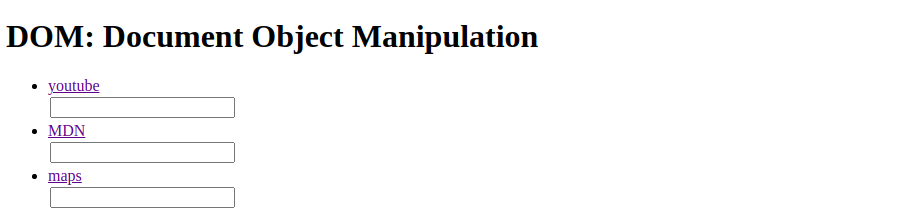

## Prevent Default

Il metodo `preventDefault ()` dell'interfaccia Event dice al programma utente che se l'evento non viene gestito esplicitamente, la sua azione predefinita non dovrebbe essere eseguita come sarebbe normalmente. L'evento continua a propagarsi come al solito, a meno che uno dei suoi listener di eventi non chiami `stopPropagation ()` o `stopImmediatePropagation ()`, entrambi i quali terminano immediatamente la propagazione.

*Fonte: https://developer.mozilla.org/it/docs/Web/API/Event/preventDefault*

Consideriamo il seguente esempio. 



Al click di ogni link vorrei che venisse stampato per esteso il link nella casella testuale.

```html
<!DOCTYPE html>
<html lang="en">

<head>
    <meta charset="UTF-8">
    <meta name="viewport" content="width=device-width, initial-scale=1.0">
    <title>Document</title>
    <style>
        li {
            margin: 2px;
        }
        input {
            margin: 2px;
        }
    </style>
</head>

<body>
    <h1>DOM: Document Object Manipulation</h1>
    <ul>
        <li>
            <a href="https://www.youtube.com/">youtube</a><br>
            <input type="text">
        </li>
        <li>
            <a href="https://developer.mozilla.org/en-US/">MDN</a><br>
            <input type="text">
        </li>
        <li>
            <a href="https://www.google.com/maps">maps</a><br>
            <input type="text">
        </li>
    </ul>
    <script>
        var linkList = document.querySelectorAll("a");

    
        for (let i = 0; i < linkList.length; i++) {
            linkList[i].addEventListener("click", function(){
                //this rappresenta l'elemento <a> i-esimo
                //this.parentElement === <li>
                //this.parentElement.lastElementChild === <input>
                input = this.parentElement.lastElementChild;
                input.value = this.href;
            });
        }
    </script>
</body>
</html>
```


Se avete provato ad eseguire il codice noterete che al click sull'elemento `<a>`, la pagina verrà rendirizzata sul link corrispondente, in poche parole non funziona. Questo accade perchè il *comportamento di default* di `<a>` tag è quello di saltare alla pagina specificata dall'attributo `href`. Per inibire il comportamento di default di qualsiasi elemento si utilizza il metodo `prevenDefault()` applicato all'oggetto ricevuto come parametro (opzionale) dal listener. Normalmente questo oggetto viene indicato con `e`.

Qui sotto riporto l'esempio funzionante.

```html
<!DOCTYPE html>
<html lang="en">

<head>
    <meta charset="UTF-8">
    <meta name="viewport" content="width=device-width, initial-scale=1.0">
    <title>Document</title>
    <style>
        li {
            margin: 2px;
        }
        input {
            margin: 2px;
        }
    </style>
</head>

<body>
    <h1>DOM: Document Object Manipulation</h1>
    <ul>
        <li>
            <a href="https://www.youtube.com/">youtube</a><br>
            <input type="text">
        </li>
        <li>
            <a href="https://developer.mozilla.org/en-US/">MDN</a><br>
            <input type="text">
        </li>
        <li>
            <a href="https://www.google.com/maps">maps</a><br>
            <input type="text">
        </li>
    </ul>
    <script>
        var linkList = document.querySelectorAll("a");

    
        for (let i = 0; i < linkList.length; i++) {
            linkList[i].addEventListener("click", function(e){
                //this rappresenta l'elemento <a> i-esimo
                //this.parentElement === <li>
                //this.parentElement.lastElementChild === <input>
                input = this.parentElement.lastElementChild;
                input.value = this.href;
                e.preventDefault();
            });
        }
    </script>
</body>
</html>
```


### Che cos'è esattamente l'oggetto ricevuto come unico parametro "e"?

**L'interfaccia Event (oggetto "e")**<br>
I gestori degli eventi possono essere assegnati a vari elementi DOM. Quando un dato evento si verifica, un oggetto evento viene creato dinamicamente e passato agli event listener che permettono di gestirlo. L'interfaccia Event del DOM è quindi accessibile dalla funzione che gestisce l'evento, alla quale viene passato un oggetto evento come primo e unico argomento (**e**).

*Fonte: https://developer.mozilla.org/en-US/docs/Web/API/Event*

```js
//..
console.log(e);
/**
MouseEvent {isTrusted: true, screenX: 196, screenY: 208, clientX: 196, clientY: 105, …}
altKey: falsebubbles: truebutton: 0buttons: 0cancelBubble: falsecancelable: trueclientX: 196clientY: 105composed: truectrlKey: falsecurrentTarget: nulldefaultPrevented: falsedetail: 1eventPhase: 0fromElement: nullisTrusted: truelayerX: 196layerY: 105metaKey: falsemovementX: 0movementY: 0offsetX: 149offsetY: 12pageX: 196pageY: 105path: (8) [a, li#ciao.myClass, ul, div, body, html, document, Window]relatedTarget: nullreturnValue: truescreenX: 196screenY: 208shiftKey: falsesourceCapabilities: InputDeviceCapabilities {firesTouchEvents: false}srcElement: atarget: atimeStamp: 125025.42499999981toElement: atype: "click"view: Window {window: Window, self: Window, document: document, name: "", location: Location, …}which: 1x: 196y: 105__proto__: MouseEvent
*/
```

L'oggetto "Event" fornisce un sacco di informazioni sulla natura dell'evento scatenato. Al sito: https://developer.mozilla.org/it/docs/Web/API/Event è possibile visionare ogni proprietà e ogni metodo dell'oggetto **Event (e)**

